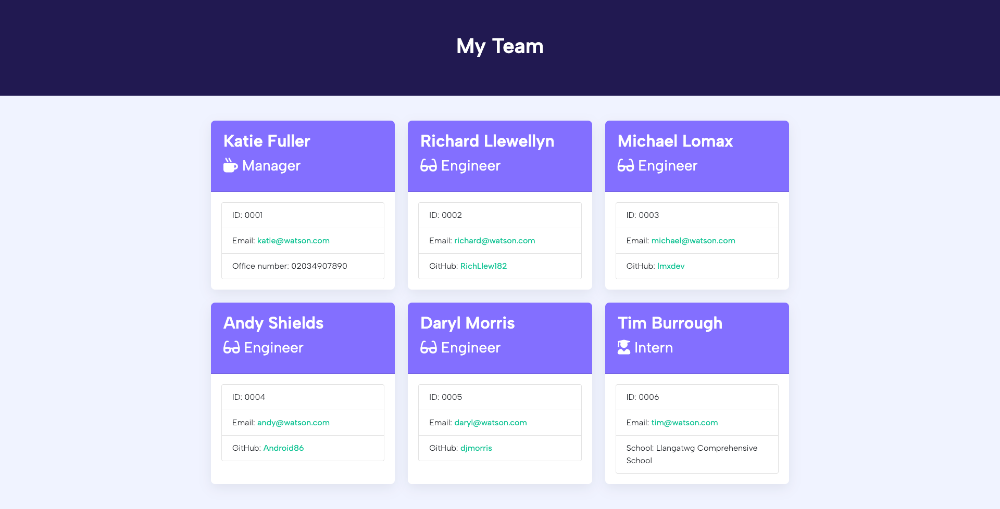

# Team Profile Generator
Module 12 Challenge for EDX Bootcamp

<!-- TABLE OF CONTENTS -->

  
Table of Contents

  <ol>
    <li>
      <a href="#description">Description</a>
      <ul>
        <li><a href="#built-with">Built With</a></li>
      </ul>
    </li>
    <li>
        <a href="#installation">Installation</a>
    </li>
    <li><a href="#usage">Usage</a></li>
    <li><a href="#testing">Testing</a></li>
    <li><a href="#license">License</a></li>
    <li><a href="#contact">Contact</a></li>
    <li><a href="#acknowledgments">Acknowledgments</a></li>
  </ol>

<!-- ABOUT THE PROJECT -->
## Description

 
 
This was the 12th homework challenge for the EDX Bootcamp in Front End Development.
 

   
Our task was to take some starter code and convert it into a working Node.js command-line application.

 

 
The application takes in information about employees on a software engineering team, and then generates a html webpage that displays summaries for each team member.

 

### Built With

* 
* 
* 
* 
* 
* 

## Installation

  To install this app, please open the folder in a new integrated terminal and then type the following:
~~~sh
npm i
~~~

<!-- USAGE EXAMPLES -->
## Usage

To use this project, please first clone the repository to your local machine.

To run the project, open the folder in your integrated terminal, and run the following command:

~~~sh
node index.js
~~~

You will be prompted in the terminal to input your details as a Manager of the team, such as Name, ID, Email and Office Number. Some of these fields are validated to only accept certain characters or valid inputs.

The app will give you 3 choices:

* Add an Engineer
* Add an Intern
* Finish Building Team.

If you choose either Engineer or Intern you will then be asked to input the details of the relevant team member, such as Name, ID, email, and then either GitHub username for Engineer or School Name for Intern. When you have finished adding all the details you will be taken back to the menu, and from there you can either add more team members or finish building your team.

Once you have finished building your team a HTML document will be generated in the output folder. You can view your newly genereated team by opening this file in your default browser.

<!-- TESTING EXAMPLES -->
## Testing

This app uses Jest to test that the code is functioning as expected. To run these tests, open the folder in a new integrated terminal and run the following:
~~~sh
npm run test
~~~

<!-- LICENSE -->
## License

Distributed under the MIT License. See `LICENSE.txt` for more information.

<!-- CONTACT -->
## Contact

Richard Llewellyn - richard.lee.llewellyn@gmail.com 

Project Repo Link: [https://github.com/RichLlew182/team-profile-generator](https://github.com/RichLlew182/team-profile-generator)

Sample HTML Link: [https://github.com/RichLlew182/team-profile-generator/blob/main/output/team.html](https://github.com/RichLlew182/team-profile-generator/blob/main/output/team.html)

<!-- ACKNOWLEDGMENTS -->
## Acknowledgments

* [Img Shields](https://shields.io)
* [Best README Template](https://github.com/othneildrew/Best-README-Template)
